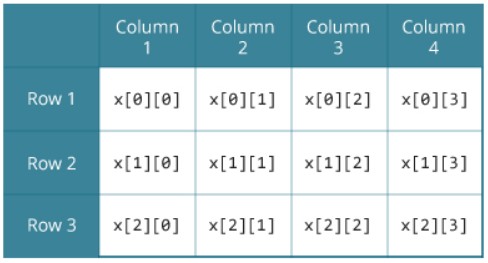

09-16-20

# 배열 (Array)
* 데이터가 많을때 사용한다 
    * 배열은 많을수 있으면서 그 데이터의 개수가 변경될수 있는 데이터들의 집합을 정해줄수있다 
* 동일한 타입의 데이터가 여러개 저장 되어있는 메모리 저장장소 
* 정수로 되어있는번호(index) 를 이용해 데이터 접근

## 배열의 제한사항
* 동일한 타입의 데이터만 저장 할수 있다 
    * 배열에 다른 데이터타입은 담을수 없다. ex) int 랑 double 은 같이 못담는다 
    
## 선언 방법 
* int Array[5]; 
    * 데이터를 저장하기 위해 Array[1] = 72 라고 사용한다 
    * []에 들어가는 숫자는 정수어어야한다 = index 라고 한다  
    
# 다차원 배열
* 배열이 배열의 원소로 들어가는 구조 
* 이차원 배열은 M x N 형태이다 
* 다차원 ㅐ열을 적절히 활용하게 되면 현실 세계의 다양한 문제에 보다 쉽게 접근가능하다 
 [출처](https://www.programiz.com/c-programming/c-multi-dimensional-arrays)
    