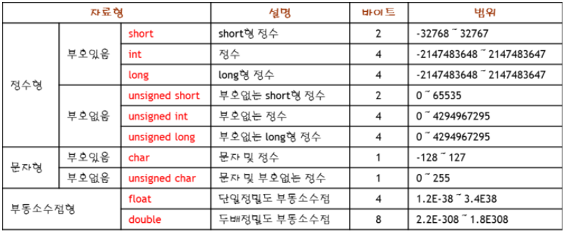

09-11-20 / 09-21 

# 자료형(Data Types)

[출처](https://m.blog.naver.com/sharonichoya/220339079484)

## 구조
* 원시 자료형(Primitive)
    * 문자형 (char)
    * 정수형 (short, int, long)
    * 실수형 (float, double)
    * void
    
* C언어에서는...
    * 문자를 표현 : char 
        * scanf("%s", char, sizeof(char)); // sizeof 는 ___개의 문자만 받겠다고 해서 사용한다 
    * 숫자 표현 : int, float, double 
        * %d, %f, %lf
    * 자료형 없음 : void
    * 문자열 저장하는 String자료형이 없고, char 만 사용
    * 상수를 사용하는 방법은 변수앞에 const 를 붙여준다 
    
* 파생 자료형(Derived)
    * Array
    * Pointer
    * Functions
    
* 사용자 정의 자료형(User defined) 
   * enum
   * Structure
   * Union
   
### char 자료형

        #include <stdio.h>
        
        int main(void) {
        
            int x = 65;
            printf("%c\n", x);
        
            char y = 'A'; // 65 이라고 해도 A가 출력된다. 아스키 코드라고 한다. 
            printf("%c\n", y);
        
            char z = 'B';
            printf("%c\n", z);
            printf("%d", z); // 66이 나온다 
            return 0;
        }
   
checking something 