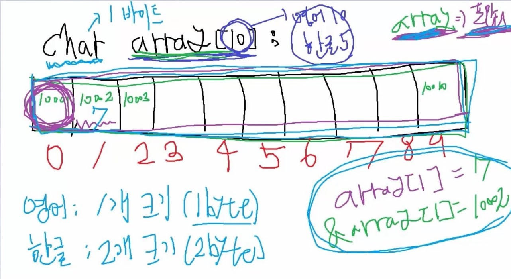

09-17-20

# 문자열 (String)
* 문자들의 집합 

        A // 문자 / char형 변수에 저장된다
        ABC // 문자열
    

* 총 10개의 문자를 저장할수 있는 array 가 만들어 진다 
* 영어 문자 : 한 문자당 1개의 크기 (1byte)
* 한글/중국어 : 1 바이트만으로 표현이 안되기 때문에 한 문자당 2바이트를 사용한다
* array 의 크기가 10이면, 영어는 10개가 들어갈수 있고 한글은 5글자만 들어갈수있다 
    * array 도 내부적으로는 포인터로 구현되어 있다 
* 첫번째 가르키는 10001 은 주소값이다 
    * array 에 대한 값을 불러오면 그 위치에 대한 주소를 반환한다 
    * array = 포인터 라고 할수있다 
* array[1] = 7 - 7이라는 값
* &array[1] = 10002 - 주소값 

# 문자열처리 라이브러리
## string.h 파일 
* <u>strlen (string length)</u> 
    * 문자열의 길이를 알려주는 함수
* unsigned int strlen(char* str);     
    * 길이를 알고자 하는 문자열을 매개변수로 넣어주면 그 갯수를 리턴해준다
    * 배열의 이름은 char* 타입의 포인터이다

* <u>strcmp (string compare)</u>    
    * 두개의 문자열을 비교해주는 역활 
        * 두 문자열이 일치하는지, 다르다면 어떤 문자열이 사전적인 순서로 볼때 앞에 있는지 알려준다 
        
* int strcmp(const char* str1, const char* str2);
    * 콤마를 이용하여 각각 문자열을 넣어준다 
    * str1과 str2가 동일한 문자열 : 리턴값 0
    * str1이 str2보다 사전순서로 볼때 앞에 있다 : 리턴값 -1
    * str1이 str2보다 사전순서로 볼때 뒤에 있다 : 리턴값 1
    * 사전 구현하기, 영단어 암기장 구현할때 유용하게 쓰인다 
    
* <u>strcpy (string copy)</u>
    * 하나의 문자열을 다른 하나로 복사한다 
    * 내부적으로 포인터를 가지고 있는 함수 
* char* strcpy(char* abc, char* def);
    * def 에 들어있는 문자열을 abc 로 복사한다 
    * def 는 char형 포인터이다 
    * def의 NULL 문자를 만나면 복사를 중단한다
        * 리턴값은 abc가 다시 나온다 
        * abc의 크기는 def보다 크거나 같아야한다    
            

