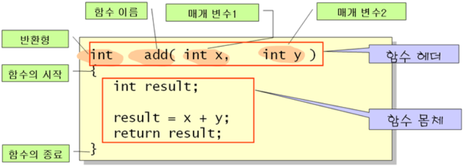

09-15-20

# 함수 (Functions)

## 개념
* C언어로 작성된 프로그램은 함수 + 함수.. 이다 

## 구조 

[출처](https://m.blog.naver.com/sharonichoya/220462618692)

### 함수 헤더 : 머리에 해당하는 부분  
* 반환형
    * 출력이라고 볼수있다 
    * 함수가 어떤 기능을 수행하고 난 뒤에 그 긴능의 수행결과를 반환하는 값의 타입(형태) 이다
    * 어떤 기능을 수행하고 나면, int 타입의 결과를 반환한다 

* 함수 이름
    * 이름은 프로그램을 작성하는 사람이 임의로 생성가능하다
    * 키워드(예약어)는 사용못하며, 명명규칙을 따라야한다

* 매개변수들로 구성 
    * Argument / Parameter / 전달인자 등으로 불린다 
    * 입력에 해당한다 
    * 함수의 내부적으로 어떠한 처리를 도와주는 기본적으로 존재하는 변수 

### 함수의 시작과 끝
* { 로 시작 } 로 끝난다 

### 함수 몸체
* 함수의 핵심이다 
* 함수가 수행해야할 가능들을 프로그래밍 한다 

* <u>return</u>
    * 어떠한 기능을 다 수행하고 난 뒤에, 실제로 발생하는 결과물을 돌려주기 위한 문장이다
    * return 은 반환이 된다 
    * 마지막 반화결과물을 이 문장에 의해 수행한다 