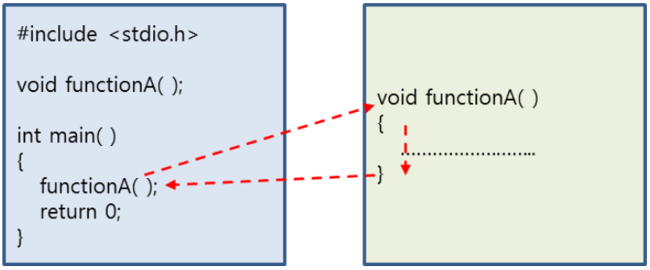
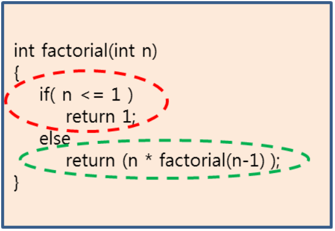

09-15-20

# 재귀함수 / 순환함수 (Recursion)
* 자기 자신에게 다시 돌아오는 함수
* 반복문을 이용해도 되지만, 효율성면에서 재귀함수가 좋다  
    * 반복함수는 단순히 while / for 문법을 이용해 특정한 처리를 반복하는 방식으로 문제를 해결하는 함수  
    
## 함수의 호출 / 리턴 
* main 함수에서 출발해서 어떤 함수를 호출하게되면, 그 함수로 가서 함수의 내용을 모두 수행하고 리턴한다 
    * 리턴하게 되면 자신을 호출했던곳으로 다시 돌아온 후에 아래의 내용을 실행하게 된다 
    

[출처](https://m.blog.naver.com/sharonichoya/220477314454)    

* 위 그림처럼, functionA()를 수행하다가 다시 functionA()를 호출하는게 재귀함수이다 
* 함수가 자시 자신을 호출하고, 그 안에서 또 자신을 호출하는 형태의 함수 = 재귀함수
* 재귀함수를 작성할때는 함수의 호출이 끝날수있는 지점이 있어야 한다 
    * 무한루프에 빠질수있다 / runtime error

## 재귀함수 예 (팩토리얼)    
   
 
* 재귀함수는 동그라미 저 두부분으로 나뉘어야 한다 
* 빨간색 : 재귀함수가 멈추는 구간 
    * 멈출수 있는 조건을 작성해야 한다 
* 초록색 : 재귀호출을 하고있다  