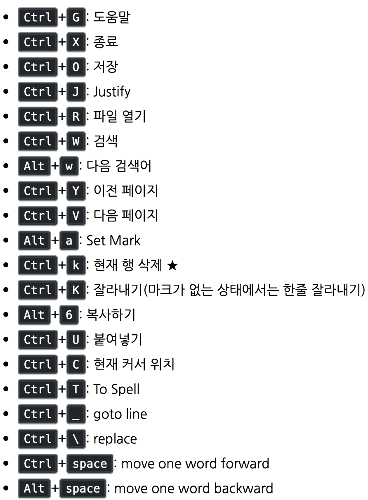

09-28-20

# 리눅스 (Linux)
* 유닉스 기반 개인컴퓨터용 공개 운영체제
* 유닉스 : 중대형 컴퓨터에서 주로 사용
* 리눅스 : 워크스테이션이나 개인용 개인용 컴퓨터에서 주로 활용 
* 소스코드를 무료로 공개하며, 프로그램 개발자 그룹을 형성하고 있다 
* 파일구성이나 시스템기능의 일부는 유닉스 기반으로 하면서, 핵심 커널 부분은 유닉스와 다르 작성되어 있다. 
* 각종 주변기기에 따라 혹은 사용하는 시스템의 특성에 맞게 소스를 변경할수있다 
* 리눅스의 기본은 터미널(콘솔) 이다 
* [출처](https://terms.naver.com/entry.nhn?docId=1180044&cid=40942&categoryId=32839)

## File & Directory
* ls 
    * 현재 디렉토리의 파일 목록을 출력하는 명령어 
* pwd
    * 현재 위치하고 있는 디렉토리를 알려주는 명령어
* mkdir
    * 새로 생성할 디렉토리명 
* cd
    * 이동할 디렉토리의 경로명 
* 상대경로 / 절대경로
    * 상대경로 : 현재 디렉토리의 위치를 기준으로 다른 디렉토리의 위치를 표현
    * .. 은 부모 디렉토리를 의미한다
    
    * 절대경로 : 최상위 디렉토리를 기준으로 경로를 표현한다
    * 최상의 디릭토리는 루트(root) 디렉토리라고 한다     
* rm
    * rm : 파일명
    * rm -r : 디렉토리명 
* --help
    * 명령어 뒤에 --help 를 붙이면 명령의 사용설명서가 출력된다 
        * ls --help
        * rm --help
        * mkdir --help
        * pwd --help        
        
## sudo 
* 유닉스에서 다른 사용자의 보안 권한, 슈퍼유저로서 프로그램을 구동할수 있도록 하는 프로그램 
* 각 명령줄에 사용할수 있다 
* sudo 명령어를 실행하기 전에, 사용자들은 비밀번호를 입력한다 

        $ sudo mkdir test
        
## 편집기 (파일편집) 
### nano 에디터 
* 유닉스 기반 기본 에디터 
* 리눅스와 OS X 에 기본으로 탐재되어 있다 
    * 윈두우 에서는 정식 포트버전이 있어서 압축한뒤 실행하면 된다 
* 다른 에디터인 vim 보다는 쓰기가 엄청 편하다 
    * 설치후 실행하면 설명이 잘 되어있다     
* 단축키

        
[출처](https://zetawiki.com/wiki/Nano_단축키)
* 맥에서 nano 이용시 잘나내기 하는 법
    * esc + 6 누르고 방향키 -> ctrl k -> ctrl u

09-29-20

## 패키지 매니저 
* 스마트폰 앱스토어와 같이 유용한 프로그램들을 받을수 있는 툴이다 
* 리눅스 버젼마다 다른 패키지 매니저를 사용하는 경우도 있다 
* ls / mkdir 등등 기본적으로 내장되어 있는 것들도 있다 
 
### 패키지 매니저로 프로그램 설치하기 
* 프로그램 목록 최신화 
    * (sudo) apt-get update
* 프로그램 목록중 htop(프로그램) 키워드로 검색하기 
    * (sudo) apt-cache search htop
* 프로그램 설치하기
    * (sudo) apt-get install htop
* 프로그램 실행하기 
    * (sudo) htop
* 프로그램 삭제하기 
    * (sudo) apt-get remove htop   
* [출처](https://siyoon210.tistory.com/65)      
      
#### 맥에서는!
* 터미널에서 이용하려면 (sudo) apt-get 대신 brew 를 사용해야 한다 
    * apt, yum 이란 패키지가 없다 
* 위에 부분들을 터미널에서 이용시에 : 

            brew update;
            brew search htop
            brew install htop
            htop
            brew remove htop             
<<<<<<< HEAD
            
## GUI VS CLI
* 운영 체제는 사용자와 하드웨어 구성 요소 간의 인터페이스이다
* 운영 체제는 사용자가 작업을 수행할수 있도록 GUI / CLI 를 제공한다
* GUI 는 컴퓨터와 상호 작용할수있는 컨트롤 또는 위젯으로 구성된다
* CLI 를 사용하는 경우 사용자는 작업을 수행하기 위해 명령을 입력해야한다 
* GUI 는 사용자에게 친숙하지만 CLI 에서는 실행 속도가 더 빠르다 

### GUI (Graphical User Interface)
* 그래픽 사용자 인터페이스             
* Windows, 아이콘, 레이블, 텍스트 상자 밑 라디오 단추와 같은 구성 요소를 사용해 사용자가 컴퓨터와 상호작용 할수 있게 한다 
* 아이콘을 쉽게 클릭하고 마우스를 사용해 객체를 끌어다 놓을수 있다 
* Windows 및 Linux 와 같은 운영체제는 GUI 를 제공한다 
    * 창, 아이콘, 검색 창, 메뉴, 드롭 다운 목록 등등 이 있다 
    
### CLI(Command Line Interface)   
* 명령 행 인터페이스
* 명령 언어 인터프리터, 콘솔/문자 사용자 인터페이스, 사용자가 터미널에 명령을 입력해 작업을 수행할수 있다 
* 사용자가 명령을 입력하고 "enter" 키를 누르면 터미널 또는 쉘이 해당 명령을 해석하고 터미널에 응답을 표시한다 

[출처](https://ko.strephonsays.com/difference-between-gui-and-cli) 
