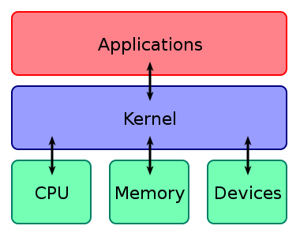

20-08-07
# Shell, vim command for git
## Before Linux
* 1965년: 데니스 리치, 켄 톰슨이 PDP-7 기반 어셈블리어로 작성한 UNIX 개발 
* 1973년: 데니스 리치, 켄 톰슨이 C를 개발후, C 기반 UNIX 재작성
* 1984년: 라차드 스톨먼, 오픈 소프트웨어 자유성 확보 위해 GNU 프로젝트 돌입
    * GNU == Gnu is Not Unix
    * GNU 프로젝트에는 커널이 없었다 
* Kernel
    * 하드웨어와 응용프로그램을 이어주는 운영체제의 핵심 시스템소프트웨어
    
        
    
## About Linux
* 리누스 토발즈가 작성한 커널/GNU 프로젝트 라이버리와 도구가 포함된 운영체제
* PC/모바일/서버/임베디드 시스템 등 다양한 분야에서 활용
* Redhat / Debian / Ubuntu / Andriod 등 다양한 배포판 존재
## Shell
* 운영체제의 커널과 사용자를 이어주는 소프트웨어 
* 유닉스 쉘 
    * sh(Bourne Shell): Steve Bourne
    * csh: Bill Joy (C언어랑 비슷한 모양)
    * bash(Bourne Again Shell): Brian Fox 
        * 다양한 운영체제에서 기본 쉘
    * zsh: Paul Falstad
        * sh 확장형 쉘
## Bash
### Sehll Command Basic

        $ cd documents
        
        $ mkdir dev # - make directory dev
        $ cd dev # - change directory
        $ cd .. # - go up
        $ pwd # - print working directory
        
        $ ls
        $ ls -al
        
        $ touch hello.py # - create hello.py
        $ exit # - terminate shell
### chmod
* 파일의 권한을 성정할 때 사용
* drwxr-xr-x d or -: directory or file (user)(group)(other) 
    * r: read
    * w: write
    * x: execute
    * -: no permission
### Vim
* Vim Basic 

        h,j,k,l - move cursor i - insert mode v - visual mode d - delete y - yank p - paste u
        undo r - replace $ - move end of line ^ - move start of line :q - quit :q! 
        quit w/o write(no warning) :wq - write and quit :{number} - move to {number}th line
        
