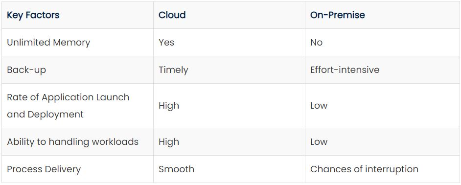

20-08-11

# Server System Infrastructure(SSI)

## On-Premise vs Cloud 
### Hosting

##### On-Premise
* The infrastructure is maintained at the premises of the organization. 
* Requirement of additional maintenance personnel for server management.

##### Cloud
* The infrastructure is maintained over the network.
* Upgrading software
* Addressing downtimes
* Repair and maintenance

### Server  

### Deployment

##### On-Premise
* Maintain infrastructure on your own
* Directly reflects in investment
    * Servers, Software and Technical personnel
* Entire risk at times of failure lies with the organization
* Server is on board

##### Cloud
* Safer perspective for business
* Any loss incurs only the subscription charges needed for utilizing its virtual environment
* Offer high flexibility in the implementation of broader infrastructure
* Faster installation / support services

## Container
* Runs on Docker Engine :
    * Standard: Docker created the industry standard for container, portable anywhere
    * Lightweight : 
        * Share the machine's OS system kernel
        * Do not require an OS per application
        * Driving higher server efficiencies and reducing server and licensing costs
    * SecureL Applications are safer in containers
    * Docker provides the strongest default isolation capabilities in the industry 

## Serverless
* Execution model, cloud provider(AWS, Azure, or Google Cloud) is responsible for executing a piece of code by dynamically allocating the resources.
    * AWS : AWS Lambda
    * Microsoft Azure : Azure Functions
    * Google Cloud: Cloud Functions
* Charging for the amount of resources used to run the code.
* Things to be aware of
    * Microservices
    * Stateless Functions
    * Cold Starts 
        
   